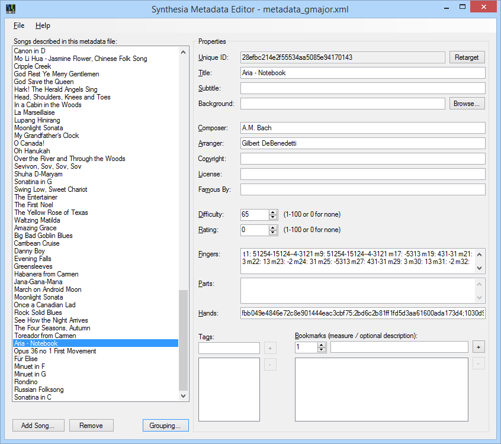

Synthesia Metadata Editor
=========================

- **[Download](https://github.com/Synthesia-LLC/metadata-editor/releases/latest) the latest release!**
- [Learn](https://github.com/Synthesia-LLC/metadata-editor/wiki) more about the .synthesia file format.
- [Get tips](https://synthesia.app/support/guide/contentCreators) on the best way to use Synthesia with metadata.

The Synthesia Metadata Editor is a PC/Mac desktop application that can generate and edit fully-compliant Synthesia metadata (.synthesia) files.

The editing capabilities expose all of the available functionality of the Synthesia metadata file format including simple content tags, background images, finger hints, and more as the standard develops.

Requires .NET 4.8 on Windows.
